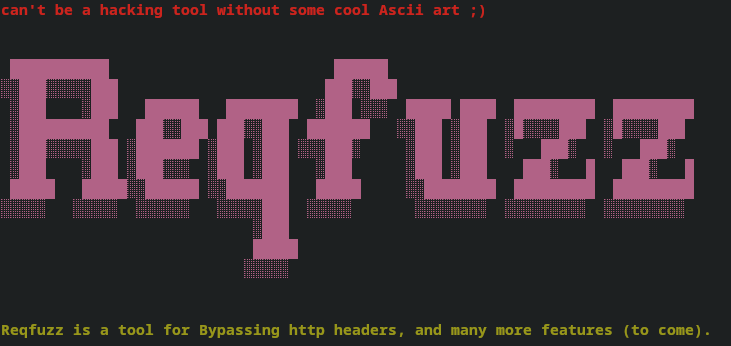

# ReqFuzz



### Description

**ReqFuzz** is a versatile tool designed for fuzzing HTTP headers to uncover potential security vulnerabilities and bypass restrictions. It tests various header configurations to see how they affect web applications, helping identify issues related to header handling and access control. The tool supports multiple HTTP methods (`GET`, `POST`, `PUT`, etc.) and leverages multithreading to efficiently manage and test a large number of header variations.

### Usage Guide

#### Basic Command

To start using ReqFuzz, you can run:

```bash
python reqfuzz.py -b <request_file>
```

- **`<request_file>`**: Specifies the file containing the HTTP request details, including the method, endpoint, protocol, headers, and body.

#### Additional Options

- **`-b <request_file>`**:
  - **Purpose**: Defines the file with the HTTP request to be tested.
  - **Format**: This file should include the request method, endpoint, protocol, and optionally, headers and body content.

- **`-H <header_file>`** (optional, used with `-b`):
  - **Purpose**: Provides a file with additional headers to be tested.
  - **Format**: Each line in the file should follow the format `Header-Name: Header-Value`.

- **`-f <request_file>`**:
  - **Purpose**: Specifies a request file to be fuzzed using a payload.
  - **Format**: This file should include the HTTP request details similar to the `-b` option.

- **`-p <payload_file>`**:
  - **Purpose**: Provides a file with payloads to test in place of `FUZZ` in the headers or request body.
  - **Format**: Each line in the file represents a different payload to be tested.


- **`-help`**:
  - **Purpose**: Displays the help menu with instructions on how to use the tool.

#### Examples

1. **Fuzz Headers from Request File**:
   ```bash
   python reqfuzz.py -b request.txt
   ```
   - Reads the HTTP request from `request.txt` and tests it with the default headers.

2. **Fuzz Headers with Additional Headers**:
   ```bash
   python reqfuzz.py -b request.txt -H headers.txt
   ```
   - Tests the HTTP request from `request.txt` using additional headers specified in `headers.txt`.

3. **Fuzz Headers Using Payloads**:
   ```bash
   python reqfuzz.py -f request.txt -p payloads.txt
   ```
   - Fuzzes the HTTP request from `request.txt` with payloads provided in `payloads.txt`.


4. **Show Help Menu**:
   ```bash
   python reqfuzz.py -help
   ```
   - Provides information on how to use the tool and its available options.

### Features

- **Multithreading**: Enhances performance by testing multiple headers concurrently.
- **Header Fuzzing**: Tests various headers to detect how they influence server behavior and identify potential security issues.
- **Bypassing Localhost Restrictions**: Useful for testing and bypassing localhost-specific access controls.
- **Extensible Design**: Easy to add new features and modify existing functionality.
- **Error Handling**: Provides clear feedback on issues such as missing files or incorrect formats.

### Use Cases

- **Security Testing**: Evaluate how different headers impact the security of your web applications.
- **Localhost Restriction Bypass**: Test and bypass localhost-specific access controls.
<<<<<<< HEAD
- **Fuzzing Request Headers and Body**: Dynamically fuzz request headers and request body using specified payloads.
- **Compliance and Performance Checks**: Ensure that your application meets security standards and performs well under various header configurations.

---
=======
- **Fuzzing request headers**: it can fuzz request headers and request body on the fly
- **Compliance and Performance Checks**: Ensure that your application meets security standards and performs well under various header configurations.
>>>>>>> 09d2afeaa7781d9c3aa84cf8bb1c431c6328019b
